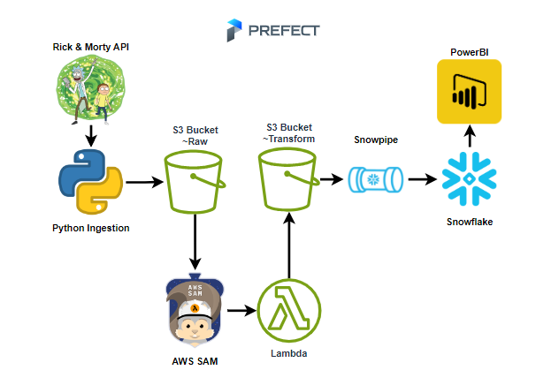
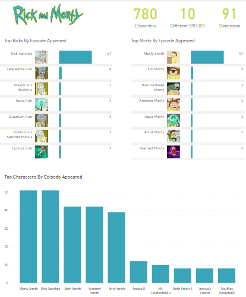
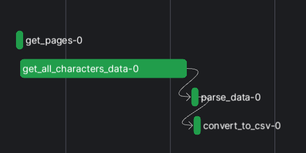
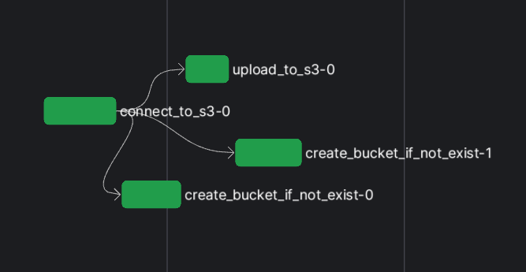
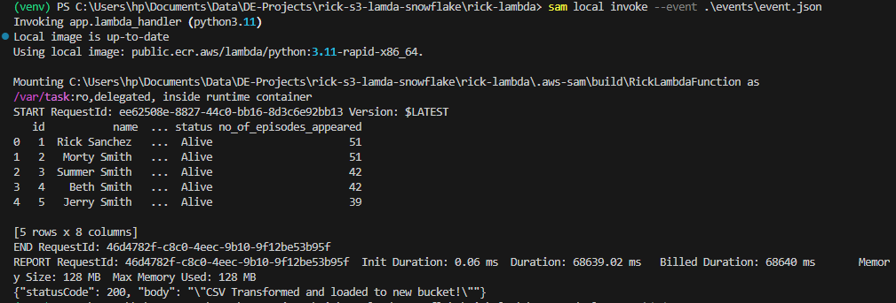

# Rick & Morty End2End Pipeline

This pipeline starts by running a **Python script** to connect to the Rick & Morty API and retrieve data on all characters in the series. The retrieved data is then **parsed** and **saved** as a **CSV file**, which is loaded into an **S3 bucket**. Subsequently, an **AWS Lambda function** is triggered to transform the CSV file, **built and deployed** using **AWS SAM**. The output is then loaded into a different S3 bucket for transformed data. **Snowpipe** is configured to automatically load the transformed CSV into **Snowflake** upon availability in the transformed bucket. Finally, **Snowflake** is connected to **PowerBI** to create **visualizations**, with o**rchestration and scheduling** managed using **Prefect**.

## Architecture

## Dashboard

## Other Snapshots

